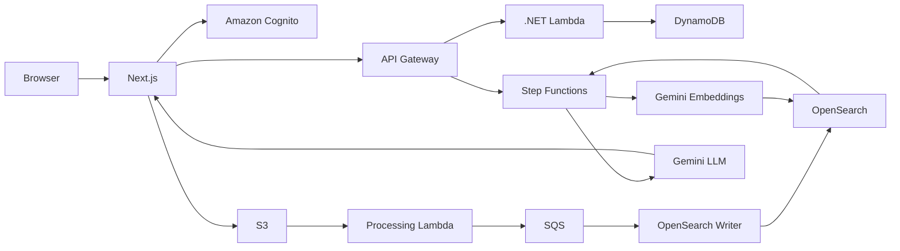
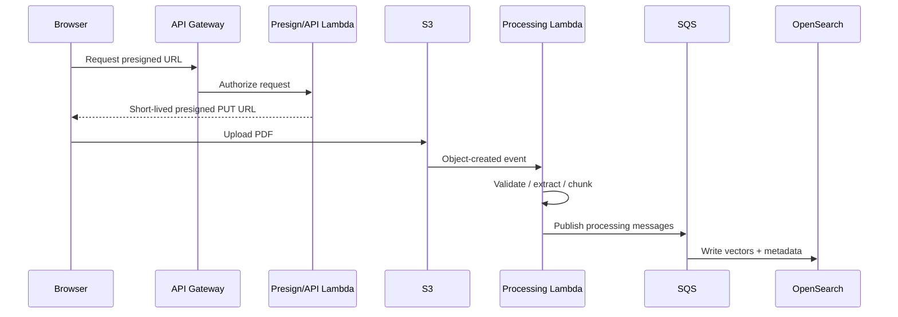
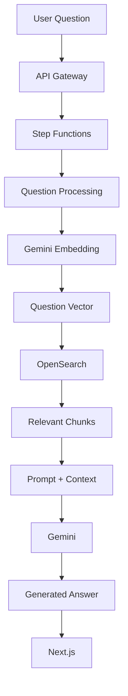
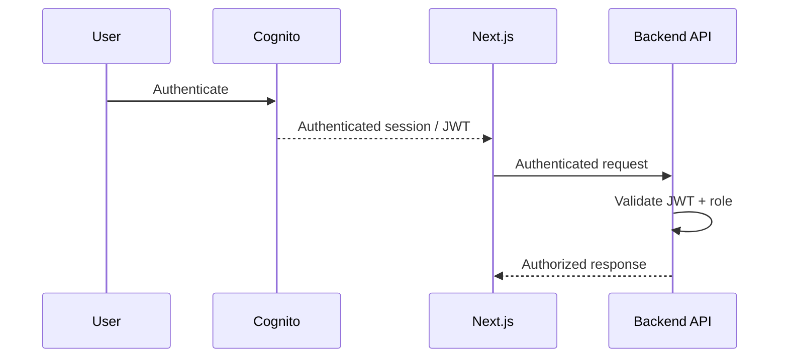

# System Architecture

## 1. Overview

The platform is split into two major concerns:

1. A **Next.js frontend** responsible for the user experience, authentication flow, document management, uploads, and question submission.
2. An **AWS serverless backend** responsible for APIs, document processing, metadata management, vector indexing, retrieval, and RAG orchestration.

The architecture favors **separation of concerns, asynchronous processing, independent scalability, and managed AWS services**.

---

## 2. High-Level Architecture



---

# 3. Document Ingestion Architecture

The document-upload path intentionally separates binary file transfer from application APIs.



### Why direct-to-S3?

Large document payloads do not need to pass through API Gateway or Lambda.

Instead:

```text
Browser
   |
   | PDF
   v
S3
```

while the backend handles:

```text
Authorization
Presigned URL
Metadata
Processing
```

This reduces unnecessary API traffic and keeps the application API lightweight.

---

# 4. Document Processing

The asynchronous processing pipeline is:

```text
S3 Object
    |
    v
Processing Lambda
    |
    +---- Validation
    |
    +---- Text Extraction
    |
    +---- Chunk Generation
    |
    v
SQS
    |
    v
OpenSearch Writer
    |
    v
OpenSearch Vector Index
```

SQS acts as a durable boundary between chunk generation and indexing.

This means a temporary indexing failure does not require the user to upload the document again.

---

# 5. RAG Query Pipeline



The important architectural principle is:

```text
Retrieve relevant information
            ↓
Provide context to the LLM
            ↓
Generate the answer
```

rather than asking the LLM to answer without application-specific document context.

---

# 6. Authentication and Authorization

Amazon Cognito provides the identity layer.



The frontend may hide or display features based on the user's role, but this is not the security boundary.

The backend must independently validate:

* Token authenticity.
* Token expiry.
* User identity.
* Application role.
* Document access permissions.

---

# 7. Data Responsibilities

| Component      | Responsibility                         |
| -------------- | -------------------------------------- |
| Amazon S3      | Uploaded document binaries             |
| DynamoDB       | Document metadata and processing state |
| SQS            | Processing messages and buffering      |
| OpenSearch     | Vector index and semantic retrieval    |
| Step Functions | Query workflow orchestration           |
| Lambda         | Stateless API and processing workloads |
| Cognito        | Authentication and identity            |

Each service has a focused responsibility rather than using one data store for every workload.

---

# 8. Reliability

The asynchronous design prevents the initial upload request from depending on every downstream processing operation.

For production deployments, important reliability controls include:

### SQS

* Retry configuration.
* Dead-letter queues.
* Visibility timeout tuning.
* Queue age monitoring.

### Lambda

* Error alarms.
* Throttling alarms.
* Appropriate timeout configuration.
* Idempotent processing.

### OpenSearch

* Cluster/domain health monitoring.
* Index health monitoring.
* Query latency monitoring.

### AI Services

* Timeout handling.
* Provider retry policies.
* Rate-limit handling.
* Failure fallback where appropriate.

---

# 9. Scalability

The architecture scales independently at several boundaries.

### Object Storage

S3 handles document storage independently of application compute.

### Compute

Lambda provides independently scalable stateless processing.

### Messaging

SQS absorbs bursts in document-processing demand.

### Retrieval

OpenSearch provides a dedicated search/indexing tier.

### Workflow

Step Functions separates workflow orchestration from individual compute functions.

### AI

Embedding and generation workloads can be monitored independently for provider limits and latency.

---

# 10. Performance

A typical question request can involve:

```text
Client
  ↓
API Gateway
  ↓
Step Functions
  ↓
Embedding Generation
  ↓
OpenSearch Vector Search
  ↓
Prompt Construction
  ↓
LLM Generation
  ↓
Client
```

Each boundary can introduce network latency.

Performance should therefore be measured at each stage.

Important measurements include:

| Stage          | Metric                              |
| -------------- | ----------------------------------- |
| API Gateway    | Request latency                     |
| Lambda         | Duration / cold start               |
| Step Functions | Workflow duration                   |
| Embeddings     | Provider latency                    |
| OpenSearch     | Query latency                       |
| Retrieval      | Number of chunks                    |
| LLM            | Time-to-first-token / total latency |

Optimization should be based on measured bottlenecks rather than assumptions.

---

# 11. Security Boundaries

Recommended controls include:

* Validate JWT signature, issuer, audience, and expiry.
* Enforce role and document ownership checks server-side.
* Use least-privilege IAM roles.
* Keep OpenSearch private where possible.
* Use short-lived S3 presigned URLs.
* Keep AI/API secrets outside source control.
* Encrypt data in transit.
* Encrypt data at rest.
* Audit privileged document operations.

---

# 12. Architecture Trade-offs

## Serverless

### Benefits

* Independent scaling.
* Reduced infrastructure management.
* Pay-per-use model.
* Natural fit for event-driven workloads.

### Trade-offs

* Cold starts.
* Distributed-system complexity.
* Execution limits.
* Multiple network boundaries.

---

## SQS

### Benefits

* Buffering.
* Retry capability.
* Failure isolation.
* Independent producer/consumer scaling.

### Trade-offs

* Eventual consistency.
* Additional infrastructure.
* Consumers must be designed for idempotency.

---

## Step Functions

### Benefits

* Explicit workflow orchestration.
* Operational visibility.
* Retry and branching capabilities.
* Clear separation between workflow stages.

### Trade-offs

* Additional workflow transitions.
* Additional latency.
* Additional service cost.

---

## OpenSearch

### Benefits

* Vector search.
* Semantic retrieval.
* Metadata filtering.
* Dedicated retrieval infrastructure.

### Trade-offs

* Additional infrastructure.
* Capacity planning.
* Index lifecycle management.
* Operational cost.

---

# 13. Production Hardening Opportunities

The current implementation demonstrates the core architecture. A production deployment could additionally introduce:

* Infrastructure as Code using AWS CDK, Terraform, or SAM.
* Automated CI/CD.
* Distributed tracing.
* Centralized dashboards and alarms.
* Automated security scanning.
* Malware scanning for untrusted documents.
* Stronger idempotency guarantees.
* RAG evaluation datasets.
* LLM response-quality evaluation.
* Streaming responses.
* Multi-tenant data isolation.
* Automated cost monitoring.

These are presented as future hardening opportunities rather than claims about functionality already implemented in the project.
