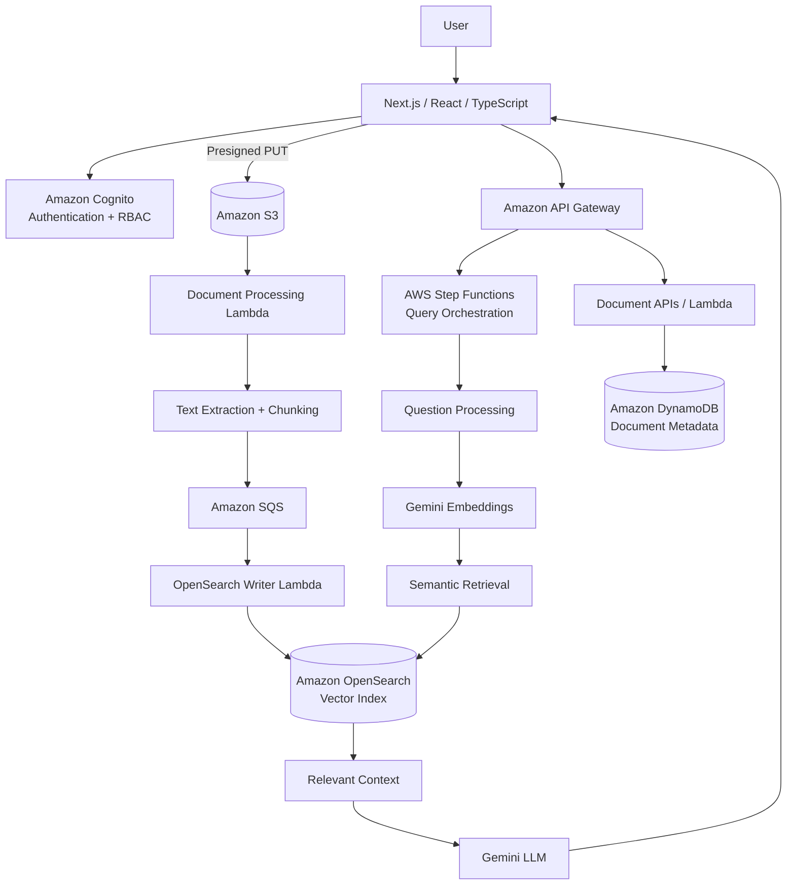
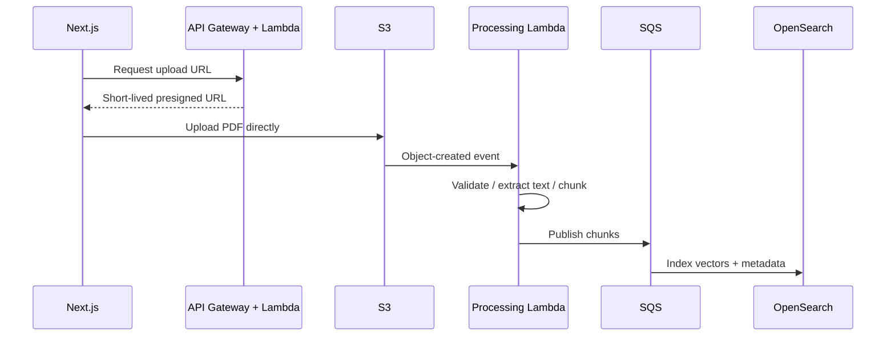
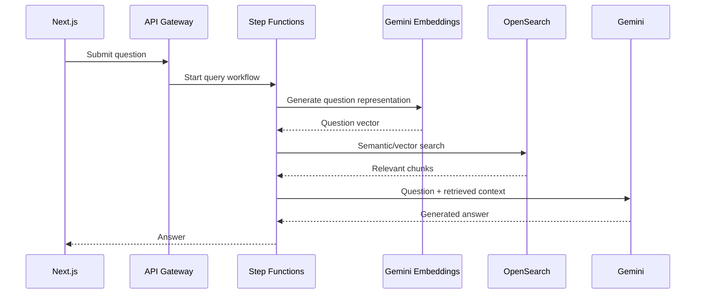

# AI Document Intelligence Platform

A full-stack, serverless document intelligence platform for secure document upload, asynchronous processing, semantic retrieval, and AI-powered question answering.

The project demonstrates **Next.js, React, TypeScript, .NET, AWS serverless architecture, Amazon Cognito, S3, DynamoDB, SQS, Step Functions, OpenSearch, and Gemini AI**.

## Architecture



## Key Capabilities

* Secure authentication using **Amazon Cognito**.
* JWT-based authentication and **role-based access control**.
* Direct browser-to-S3 document uploads using **presigned URLs**.
* Event-driven document processing.
* Asynchronous processing using **Amazon SQS**.
* Document chunking and vector indexing.
* Semantic/vector retrieval using **Amazon OpenSearch**.
* **AWS Step Functions** orchestration for the question-answering workflow.
* Gemini embeddings and LLM-based response generation.
* Separation of interactive API requests from long-running document-processing workloads.

---

## Document Processing Flow



### Processing sequence

1. An authenticated user initiates a document upload.
2. The backend validates the request and generates a short-lived presigned S3 URL.
3. The browser uploads the PDF directly to S3.
4. The S3 object-created event initiates document processing.
5. The document is validated and its content is extracted.
6. The extracted content is divided into retrieval-friendly chunks.
7. Processing messages are sent through SQS.
8. The OpenSearch writer indexes the processed content and vector information.
9. The document becomes available for semantic retrieval.

Direct-to-S3 uploads prevent large document payloads from unnecessarily passing through API Gateway and Lambda.

---

## RAG Query Flow



The RAG pipeline follows:

```text
User Question
      ↓
API Gateway
      ↓
AWS Step Functions
      ↓
Question Processing
      ↓
Gemini Embedding
      ↓
OpenSearch Vector Search
      ↓
Relevant Document Chunks
      ↓
Prompt + Retrieved Context
      ↓
Gemini LLM
      ↓
Generated Answer
      ↓
Next.js
```

The retrieval stage provides application-specific document context to the LLM before answer generation.

---

## Technology Stack

| Area           | Technology                               |
| -------------- | ---------------------------------------- |
| Frontend       | Next.js, React, TypeScript, Tailwind CSS |
| Backend        | .NET 8, AWS Lambda                       |
| API            | Amazon API Gateway                       |
| Authentication | Amazon Cognito                           |
| Authorization  | JWT + RBAC                               |
| Object Storage | Amazon S3                                |
| Metadata       | Amazon DynamoDB                          |
| Messaging      | Amazon SQS / DLQ                         |
| Orchestration  | AWS Step Functions                       |
| Search         | Amazon OpenSearch                        |
| AI             | Gemini Embeddings + Gemini LLM           |
| Architecture   | Serverless, Event-Driven, RAG            |

---

## Key Engineering Decisions

### 1. Direct-to-S3 Uploads

Instead of sending large PDF payloads through the application API, the backend generates a short-lived presigned URL.

The browser then uploads the document directly to S3.

**Benefits:**

* Reduces API/Lambda payload handling.
* Reduces application-server involvement.
* Keeps AWS credentials out of the browser.
* Allows S3 to handle the binary transfer.

---

### 2. Event-Driven Document Processing

Document processing is triggered after the document reaches S3 rather than keeping the upload request open while downstream processing occurs.

This separates:

```text
Interactive Request
       ↓
Document Upload
```

from:

```text
Document Processing
       ↓
Chunking
       ↓
Embedding / Indexing
```

This is particularly useful because document processing time can vary significantly based on document size and content.

---

### 3. SQS for Asynchronous Processing

SQS provides a durable boundary between processing stages.

```text
Processing
    ↓
   SQS
    ↓
OpenSearch Writer
```

This provides:

* Buffering during traffic spikes.
* Retry opportunities.
* Failure isolation.
* Independent scaling of producers and consumers.

---

### 4. OpenSearch for Semantic Retrieval

DynamoDB is used for application metadata and document state.

OpenSearch provides the retrieval layer required by the RAG pipeline.

This separates:

```text
Application State
      ↓
DynamoDB
```

from:

```text
Semantic Retrieval
      ↓
OpenSearch
```

---

### 5. Step Functions for Query Orchestration

The question-answering workflow contains multiple stages.

Step Functions makes the workflow explicit and provides a natural place for:

* Workflow orchestration.
* Retry handling.
* Branching.
* Operational visibility.
* Separation of individual processing steps.

---

## Security

The system uses multiple security boundaries.

### Authentication

Amazon Cognito handles user authentication and identity.

### Authorization

Backend APIs validate JWT-based identity and application roles.

Authorization is enforced server-side. Frontend role checks are treated only as a UX mechanism.

### Document Uploads

Short-lived S3 presigned URLs are used instead of exposing AWS credentials to the browser.

### IAM

AWS Lambda functions should use least-privilege IAM roles specific to their responsibilities.

### Secrets

API keys, AWS credentials, Cognito secrets, and other sensitive configuration must remain outside source control.

See [`docs/SECURITY.md`](docs/SECURITY.md) for more details.

---

## Scalability and Reliability

The architecture separates workloads across multiple independently scalable services.

### S3

Handles document object storage independently of application compute.

### Lambda

Provides stateless compute that can scale independently for API and processing workloads.

### SQS

Buffers document-processing workloads and isolates downstream failures.

### OpenSearch

Provides a dedicated search and vector-retrieval layer.

### Step Functions

Separates query orchestration from individual compute functions.

Important production metrics include:

* SQS queue depth.
* SQS message age.
* Lambda duration.
* Lambda errors.
* Lambda throttling.
* OpenSearch query latency.
* Embedding latency.
* LLM latency.

---

## Performance Considerations

The RAG query path contains several remote operations:

```text
API Gateway
    ↓
Step Functions
    ↓
Embedding Generation
    ↓
OpenSearch
    ↓
LLM
```

Each stage can contribute to end-to-end latency.

Potential optimization areas include:

* Reusing SDK/HTTP clients across Lambda invocations.
* Reducing unnecessary workflow transitions.
* Tuning OpenSearch vector queries.
* Limiting retrieved context to relevant chunks.
* Parallelizing independent operations where appropriate.
* Streaming generated responses.
* Measuring each stage independently before optimizing.

The architecture intentionally favors scalability and separation of concerns, while recognizing that distributed workflows introduce additional network hops and latency.

---

## Repository Structure

This repository contains the **AWS/serverless backend**.

The frontend is maintained separately:

**document-intelligence-system-frontend**

The two repositories together form the complete application.

---

## Architecture Documentation

For a deeper explanation of the system design, data flows, scalability considerations, and architecture trade-offs, see:

[`ARCHITECTURE.md`](ARCHITECTURE.md)

Security documentation:

[`docs/SECURITY.md`](docs/SECURITY.md)

---

## Project Status

This is a portfolio/reference implementation demonstrating:

* Full-stack development.
* Serverless AWS architecture.
* Event-driven processing.
* Asynchronous workflows.
* Vector search.
* Retrieval-augmented generation.
* Secure document handling.
* AI-powered document question answering.

The documentation distinguishes implemented architecture from additional production-hardening recommendations.
